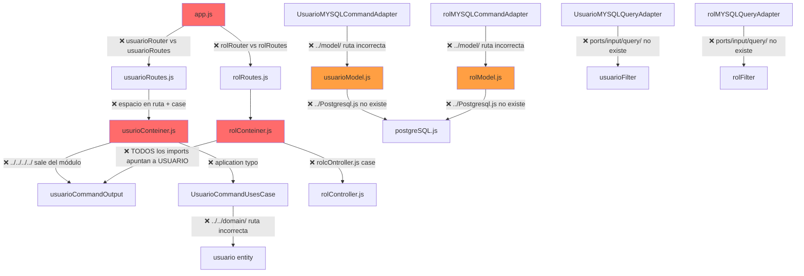

# 🏥 Auditoría Técnica y Plan de Finalización — Sistema Hospitalario

Auditoría exhaustiva del proyecto **SistemaHospitalario** (Backend Node.js/Express + Sequelize, Frontend Vite, Docker Compose con PostgreSQL). Este documento identifica **errores críticos**, **problemas de arquitectura**, **módulos incompletos** y propone un **plan de implementación por fases** para la finalización del proyecto.

---

## Resumen Ejecutivo

| Categoría | Cantidad |
|---|---|
| 🔴 Errores Críticos (Bloqueantes) | 14 |
| 🟠 Problemas de Arquitectura | 8 |
| 🟡 Módulos Vacíos / Sin Implementar | 5 |
| 🔵 Mejoras de Seguridad | 6 |
| ⚪ Client (Frontend) Inexistente | 1 (completo) |
| 🟣 Docker & DevOps | 5 |

---

## User Review Required

> [!CAUTION]
> El proyecto **NO COMPILA NI ARRANCA** actualmente. Existen al menos 14 errores de importación rotos, rutas con nombres incorrectos, y el frontend no tiene dependencias instaladas ni código fuente. Ningún módulo excepto `security` tiene implementación parcial, y éste tiene errores graves.

> [!IMPORTANT]
> Se necesitan decisiones sobre: (1) Si mantener la arquitectura hexagonal actual o simplificarla, (2) Qué módulos priorizar para el MVP, (3) Si el frontend será React/Vite u otra tecnología.

---

## Open Questions

> [!IMPORTANT]
> **Q1 — Frontend Framework:** El `client/` tiene Vite como devDependency pero sin ninguna librería UI (ni React, ni Vue, ni siquiera un `index.html`). ¿Qué framework frontend se desea usar?

> [!IMPORTANT]
> **Q2 — Prioridad de Módulos:** Hay 6 módulos (security, billing, clinical, hospital-infraestructure, patients, personal). ¿Cuáles son los de mayor prioridad para el MVP?

> [!IMPORTANT]
> **Q3 — Autenticación:** Existen dependencias `bcrypt` y `jsonwebtoken` instaladas pero sin usar. ¿Se desea implementar un sistema de login con JWT?

> [!IMPORTANT]
> **Q4 — Base de Datos:** ¿Existe un esquema SQL predefinido o se usará `sequelize.sync()` para crear las tablas automáticamente?

---

## 🔴 FASE 0 — Errores Críticos Bloqueantes

Estos errores impiden que el servidor arranque. Deben resolverse primero.

---

### 0.1 — Errores de Importación en `app.js`

#### [MODIFY] [app.js](file:///c:/Project%20PW/SisHopitalario/server/src/app.js)

**Problema:** Las variables importadas no coinciden con los nombres usados.

```diff
- import usuarioRouter from "../src/modules/security/infraestructure/routes/usuarioRoutes.js";
- import rolRouter from "../src/modules/security/infraestructure/routes/rolRoutes.js";
+ import usuarioRoutes from "./modules/security/infraestructure/routes/usuarioRoutes.js";
+ import rolRoutes from "./modules/security/infraestructure/routes/rolRoutes.js";
```

**Detalle:** Se importa como `usuarioRouter` y `rolRouter` pero se usa como `usuarioRoutes` y `rolRoutes` en las líneas 15-16. Además, la ruta relativa `../src/` es incorrecta (debería ser `./`).

---

### 0.2 — Script de Arranque Apunta a Archivo Inexistente

#### [MODIFY] [package.json](file:///c:/Project%20PW/SisHopitalario/server/package.json)

**Problema:** El script `"dev": "nodemon -L server.js"` busca `server.js` en la raíz pero el archivo real está en `src/infraestructure/server.js`.

```diff
- "dev": "nodemon -L server.js"
+ "dev": "nodemon -L src/infraestructure/server.js"
```

---

### 0.3 — `usuarioRoutes.js` Import con Espacio en Ruta

#### [MODIFY] [usuarioRoutes.js](file:///c:/Project%20PW/SisHopitalario/server/src/modules/security/infraestructure/routes/usuarioRoutes.js)

**Problema:** La línea 2 tiene un espacio al final de la ruta de importación:

```javascript
// ACTUAL (con espacio extra):
import { UsuarioController } from "../conteiner/usurioConteiner.js  ";
// CORREGIDO:
import { usuarioController as UsuarioController } from "../conteiner/usurioConteiner.js";
```

Además, se importa como `{ UsuarioController }` (named export con mayúscula) pero el container exporta `{ usuarioController }` (con minúscula).

---

### 0.4 — `rolConteiner.js` — Todos los Imports Son Incorrectos

#### [MODIFY] [rolConteiner.js](file:///c:/Project%20PW/SisHopitalario/server/src/modules/security/infraestructure/conteiner/rolConteiner.js)

**Problemas múltiples (7 errores en 18 líneas):**

| Línea | Problema | Import Actual | Import Correcto |
|---|---|---|---|
| 1 | Importa ports de USUARIO en vez de ROL | `../../../../application/ports/output/query/usuarioQueryOutput.js` | `../../application/ports/output/query/rolQueryOutput.js` |
| 2 | Importa command output de USUARIO | `../../../../application/ports/output/command/usuarioCommandOutput.js` | `../../application/ports/output/command/rolCommandOutput.js` |
| 3 | Usa adapter de USUARIO en vez de ROL | `UsuarioMYSQLCommandAdapter.js` | `rolMYSQLCommandAdapter.js` |
| 4 | Usa query adapter de USUARIO | `UsuarioMYSQLQueryAdapter.js` | `rolMYSQLQueryAdapter.js` |
| 5 | Usa caso de uso de USUARIO | `UsuarioCommandUsesCase.js` | `rolCommandUsesCase.js` |
| 6 | Usa query de USUARIO | `UsuarioQueryUsesCase.js` | `rolQueryUsesCase.js` |
| 7 | Nombre de archivo incorrecto (mayúscula random) | `rolcOntroller.js` | `rolController.js` |
| 16 | Variable se reasigna a sí misma | `const rolController = new rolController(...)` | Conflicto de nombres: la variable sombrea el import |

> [!WARNING]
> **Este archivo fue claramente copiado de `usurioConteiner.js` sin actualizar ninguna referencia.** Además, la ruta raíz `../../../../application/` sale del módulo security, lo cual rompe la arquitectura hexagonal.

---

### 0.5 — `usurioConteiner.js` — Imports con Rutas Rotas

#### [MODIFY] [usurioConteiner.js](file:///c:/Project%20PW/SisHopitalario/server/src/modules/security/infraestructure/conteiner/usurioConteiner.js)

**Problemas:**

| Línea | Problema |
|---|---|
| 2 | Ruta `../../../../application/ports/...` sale del módulo (debería ser `../../application/ports/...`) |
| 5 | Carpeta `aplication` en la ruta (debería ser `application` — falta una `p`) |
| 6 | Carpeta `aplication` igual |
| 9 | Nombre de clase `UsuarioMYSQLCommandAdaptador` no existe (el archivo exporta `UsuarioMYSQLCommandAdapter`) |
| 10 | Nombre de clase `UsuarioMYSQLQueryAdaptador` no existe (el archivo exporta `UsuarioMYSQLQueryAdaptador` — pero el nombre del archivo es `UsuarioMYSQLQueryAdapter`) |

---

### 0.6 — Controllers Importan de Rutas Inexistentes

#### [MODIFY] [usuarioController.js](file:///c:/Project%20PW/SisHopitalario/server/src/modules/security/infraestructure/adapter-input/usuarioController.js)

```javascript
// Línea 1 — ruta inexistente:
import { usuarioDTO } from "../../aplicacion/dto/usuarioDTO.js";
// Correcto: import usuarioDTO from "../../application/DTO/usuarioDTO.js";

// Línea 2 — ruta inexistente:
import usuarioInputPort from "../../../aplicacion/puertos/input/usuarioInputPort.js";
// Correcto: import usuarioInput from "../../application/ports/input/usuarioInput.js";
```

**Problemas:** (1) Carpeta `aplicacion` no existe (es `application`), (2) `puertos` no existe (es `ports`), (3) `usuarioInputPort.js` no existe (es `usuarioInput.js`), (4) `usuarioDTO` se exporta como `export default` pero se importa como named export `{ usuarioDTO }`.

#### [MODIFY] [rolController.js](file:///c:/Project%20PW/SisHopitalario/server/src/modules/security/infraestructure/adapter-input/rolController.js)

Mismos problemas: rutas `../../../aplicacion/dto/` y `../../../aplicacion/puertos/input/` no existen.

---

### 0.7 — Query Adapters Importan Filtros de Rutas Inexistentes

#### [MODIFY] [UsuarioMYSQLQueryAdapter.js](file:///c:/Project%20PW/SisHopitalario/server/src/modules/security/infraestructure/adapter-output/query/UsuarioMYSQLQueryAdapter.js)

```javascript
// Línea 2 — ruta inexistente:
import usuarioFilter from "../../../../application/ports/input/query/usuarioFilter.js";
// El archivo real está en: ../../../../domain/filters/usuarioFilter.js
// Además no existe la carpeta ports/input/query/
```

#### [MODIFY] [rolMYSQLQueryAdapter.js](file:///c:/Project%20PW/SisHopitalario/server/src/modules/security/infraestructure/adapter-output/query/rolMYSQLQueryAdapter.js)

Mismo problema: importa `rolFilter` de `ports/input/query/` que no existe (debería ser `domain/filters/`).

---

### 0.8 — Modelos Sequelize Importan de Ruta Inexistente

#### [MODIFY] [usuarioModel.js](file:///c:/Project%20PW/SisHopitalario/server/src/modules/security/infraestructure/model/usuarioModel.js) y [rolModel.js](file:///c:/Project%20PW/SisHopitalario/server/src/modules/security/infraestructure/model/rolModel.js)

```javascript
// ACTUAL:
import sequelize from '../Postgresql.js';
// PROBLEMA: No existe ../Postgresql.js dentro del módulo security
// El archivo real de conexión está en: ../../../../infraestructure/database/postgreSQL.js
```

> [!WARNING]
> Además, el nombre del archivo tiene diferente capitalización: `Postgresql.js` vs `postgreSQL.js`. En Linux (Docker), esto causará `MODULE_NOT_FOUND`.

---

### 0.9 — Command Use Cases Importan de Rutas Inexistentes

#### [MODIFY] [usuarioCommandUsesCase.js](file:///c:/Project%20PW/SisHopitalario/server/src/modules/security/application/uses-case/command/usuarioCommandUsesCase.js)

```javascript
// Línea 1:
import usuario from "../../domain/usuario.js";
// PROBLEMA: La carpeta domain no está a 2 niveles arriba de uses-case/command/
// Ruta correcta relativa: ../../../domain/entities/usuario.js
```

Mismo problema en [rolCommandUsesCase.js](file:///c:/Project%20PW/SisHopitalario/server/src/modules/security/application/uses-case/command/rolCommandUsesCase.js).

---

### 0.10 — Command Adapters Import `../model/` — Ruta Incorrecta

#### [MODIFY] [UsuarioMYSQLCommandAdapter.js](file:///c:/Project%20PW/SisHopitalario/server/src/modules/security/infraestructure/adapter-output/command/UsuarioMYSQLCommandAdapter.js)

```javascript
// Línea 2:
import usuarioModel, { sequelize } from "../model/usuarioModel.js";
// PROBLEMA: Desde adapter-output/command/, ../model/ apunta a adapter-output/model/ que no existe
// Correcto: ../../model/usuarioModel.js
```

Mismo problema en [rolMYSQLCommandAdapter.js](file:///c:/Project%20PW/SisHopitalario/server/src/modules/security/infraestructure/adapter-output/command/rolMYSQLCommandAdapter.js).

---

### 0.11 — Nombre de Archivo con Typo

El archivo [usurioConteiner.js](file:///c:/Project%20PW/SisHopitalario/server/src/modules/security/infraestructure/conteiner/usurioConteiner.js) tiene el nombre mal escrito (`usurio` → debería ser `usuario`).

---

## 🟠 FASE 1 — Problemas de Arquitectura y Lógica

Estos no bloquean la compilación pero producen comportamientos incorrectos.

---

### 1.1 — Uso Incorrecto de Transacciones Sequelize

En todos los adapters de command y query:

```javascript
// ACTUAL:
const transaction = await sequelize.transaction({...});
// ... operaciones ...
(await transaction).commit();  // ❌ transaction ya está resuelta, el await es redundante
```

`sequelize.transaction()` ya retorna una Promise que se resuelve al `transaction` object. El `(await transaction).commit()` es innecesario y confuso. Debería ser `transaction.commit()` directamente.

---

### 1.2 — `where` Inicializado como Array, Usado como Objeto

En [UsuarioMYSQLQueryAdapter.js](file:///c:/Project%20PW/SisHopitalario/server/src/modules/security/infraestructure/adapter-output/query/UsuarioMYSQLQueryAdapter.js#L10):

```javascript
const where = [];  // ❌ Inicializado como Array
// ...
where.usu_nombre = esp.username;  // ❌ Se usa como Object
// ...
await usuarioModel.findAll({ where, transaction });  // ❌ Sequelize espera un Object, no Array
```

Debería ser `const where = {};`.

---

### 1.3 — IDs Generados con `Date.now()` como String

En [usuarioCommandUsesCase.js](file:///c:/Project%20PW/SisHopitalario/server/src/modules/security/application/uses-case/command/usuarioCommandUsesCase.js#L9):

```javascript
const id = Date.now().toString();
```

Pero el modelo Sequelize define `id_usuario` como `DataTypes.INTEGER`. Usar `Date.now()` como ID numérico no es confiable (colisiones, no secuencial), y convertirlo a string para un campo INTEGER causará error. Se debería usar `autoIncrement: true` en el modelo.

---

### 1.4 — Entity `usuario` Recibe Solo 2 Argumentos en Use Case

```javascript
// En usuarioCommandUsesCase.js:
const persona = new usuario(id, await usuarioDTO.getNombre());
// Pero el constructor de usuario espera 6 argumentos:
constructor(id_usuario, username, password_hash, id_rol, activo, fecha_creacion)
```

Se están pasando solo 2 de 6 campos. `getNombre()` no existe en `usuarioDTO` (el método es `getUsername()`).

---

### 1.5 — UsuarioModel.create() Solo Envía `username`

```javascript
await usuarioModel.create({
    username: username
}, { transaction });
```

Pero los campos `password_hash`, `id_rol`, `activo`, y `fecha_creacion` son `allowNull: false` en el modelo. Esto lanzará un `SequelizeValidationError`.

---

### 1.6 — Middlewares Definidos Pero No Usados

Los 3 middlewares en [middleware/](file:///c:/Project%20PW/SisHopitalario/server/src/infraestructure/middleware) (`TraceMiddleware`, `LoggerMiddleware`, `TimeMiddleware`) no están registrados en [app.js](file:///c:/Project%20PW/SisHopitalario/server/src/app.js), pero los controllers dependen de `req.traceId`.

```diff
// En app.js, agregar:
+ import { traceMiddleWare } from "./infraestructure/middleware/TraceMiddleware.js";
+ import { loggerMiddleWare } from "./infraestructure/middleware/LoggerMiddleware.js";
+ import { timeMiddleware } from "./infraestructure/middleware/TimeMiddleware.js";
+ 
+ app.use(traceMiddleWare);
+ app.use(loggerMiddleWare);
+ app.use(timeMiddleware);
```

---

### 1.7 — DTO Expone `password_hash`

[usuarioDTO.js](file:///c:/Project%20PW/SisHopitalario/server/src/modules/security/application/DTO/usuarioDTO.js) tiene un getter `getPassword_hash()`. Un DTO de respuesta **nunca** debería exponer el hash del password.

---

### 1.8 — Imports No Usados en Controllers

`Buffer` y `zlib` son importados en ambos controllers pero nunca utilizados:

```javascript
import { Buffer } from "buffer";
import zlib from "zlib";
```

---

## 🟡 FASE 2 — Módulos Vacíos a Implementar

Los siguientes módulos tienen la estructura de carpetas creada pero **cero código**:

| Módulo | Estructura | Estado |
|---|---|---|
| `billing` | `application/{DTOs, uses-cases}`, `domain/entities`, `infraestructure/{controllers, database, rouetes}` | 🔴 Vacío |
| `clinical` | `application/{DTOs, uses-cases}`, `domain/entities`, `infraestructure/{controllers, database, rouetes}` | 🔴 Vacío |
| `hospital-infraestructure` | `application/{DTOs, uses-cases}`, `domain/entities`, `infraestructure/{controllers, database, rouetes}` | 🔴 Vacío |
| `patients` | `application/{DTOs, uses-cases}`, `domain/entities`, `infraestructure/{controllers, database, rouetes}` | 🔴 Vacío |
| `personal` | `domain/entities` (archivos vacíos: `personal.js`, `speciality.js`) | 🔴 Solo esqueleto |

> [!WARNING]
> La carpeta `rouetes` (en billing, clinical, hospital-infraestructure, patients) es un **typo** → debería ser `routes`.

### Propuesta de Entidades por Módulo

#### `patients` — Pacientes
- **Paciente**: id, nombre, apellido, fecha_nacimiento, genero, cedula, direccion, telefono, email, tipo_sangre, alergias, id_usuario
- **HistorialMedico**: id, id_paciente, descripcion, fecha

#### `personal` — Personal Médico
- **Personal**: id, nombre, apellido, cedula, telefono, email, id_especialidad, id_usuario, activo
- **Especialidad**: id, nombre, descripcion

#### `clinical` — Área Clínica
- **Cita**: id, id_paciente, id_personal, fecha_hora, motivo, estado (pendiente/confirmada/cancelada/completada)
- **ConsultaMedica**: id, id_cita, diagnostico, tratamiento, observaciones, fecha
- **Receta**: id, id_consulta, medicamento, dosis, frecuencia, duracion

#### `hospital-infraestructure` — Infraestructura
- **Sala**: id, nombre, tipo (emergencia/consulta/cirugía/hospitalización), piso, capacidad
- **Cama**: id, id_sala, numero, estado (disponible/ocupada/mantenimiento)
- **Equipo**: id, nombre, tipo, id_sala, estado

#### `billing` — Facturación
- **Factura**: id, id_paciente, fecha, total, estado (pendiente/pagada/anulada)
- **DetalleFactura**: id, id_factura, concepto, cantidad, precio_unitario, subtotal

---

## 🔵 FASE 3 — Seguridad y Autenticación

### 3.1 — Implementar Autenticación JWT

Las dependencias `bcrypt` y `jsonwebtoken` están instaladas pero no se usan. Implementar:

1. **Endpoint `POST /api/auth/login`**: Validar credenciales, retornar JWT
2. **Endpoint `POST /api/auth/register`**: Crear usuario con password hasheado
3. **Middleware `authMiddleware`**: Validar JWT en headers `Authorization: Bearer <token>`
4. **Variable de entorno `JWT_SECRET`**: Agregar al `.env`

### 3.2 — Hash de Passwords

Actualmente el `password_hash` se guarda tal cual llega del request. Implementar bcrypt:

```javascript
import bcrypt from 'bcrypt';
const hash = await bcrypt.hash(password, 10);
```

### 3.3 — Credenciales Expuestas

#### [MODIFY] [docker-compose.yml](file:///c:/Project%20PW/SisHopitalario/docker-compose.yml)

```yaml
# ACTUAL — credenciales hardcodeadas:
POSTGRES_PASSWORD: Admi123
```

#### [MODIFY] [.env](file:///c:/Project%20PW/SisHopitalario/server/.env)

```
DB_PASSWORD=Admi123
```

> [!CAUTION]
> El archivo `.env` **no debería estar en el repositorio**. Crear un `.env.example` con valores de plantilla y agregar `.env` al `.gitignore`.

### 3.4 — CORS Sin Restricciones

```javascript
app.use(cors());  // Permite TODO origen
```

Debería configurarse con los orígenes permitidos:

```javascript
app.use(cors({ origin: ['http://localhost:5173'] }));
```

### 3.5 — Sin Validación de Datos de Entrada

No existe validación de inputs. Agregar una librería como `express-validator` o `joi`.

### 3.6 — Sin Manejo Global de Errores

No existe middleware de manejo de errores. Las excepciones no capturadas pueden crashear el servidor.

---

## 🟣 FASE 4 — Docker & DevOps

### 4.1 — Dockerfiles Incorrectos

#### [MODIFY] [client/Dockerfile](file:///c:/Project%20PW/SisHopitalario/client/Dockerfile)

```dockerfile
# PROBLEMAS:
# 1. EXPOSE 3000 — pero Vite corre en 5173
# 2. RUN npm install -g nodemon — DESPUÉS del CMD (nunca se ejecuta)
# 3. nodemon no es necesario para el client
# 4. No tiene Vite como dependencia

FROM node:24
WORKDIR /app
COPY package*.json ./
RUN npm install
COPY . .
EXPOSE 3000          # ❌ Debería ser 5173
CMD ["npm", "run", "dev"]
RUN npm install -g nodemon  # ❌ Se ejecuta ANTES del CMD en build, pero es inútil para client
```

**Corrección propuesta:**

```dockerfile
FROM node:24
WORKDIR /app
COPY package*.json ./
RUN npm install
COPY . .
EXPOSE 5173
CMD ["npm", "run", "dev"]
```

#### [MODIFY] [server/Dockerfile](file:///c:/Project%20PW/SisHopitalario/server/Dockerfile)

```dockerfile
# PROBLEMAS:
# 1. RUN npm install -g nodemon DESPUÉS del CMD (no se ejecuta en runtime)
# 2. nodemon ya está en devDependencies, no necesita instalarse global

FROM node:24
WORKDIR /app
COPY package*.json ./
RUN npm install
COPY . .
EXPOSE 3000
CMD ["npm", "run", "dev"]
RUN npm install -g nodemon  # ❌ Innecesario, ya está en devDependencies
```

> [!NOTE]
> El `RUN` después del `CMD` sí se ejecuta durante el build, pero el `CMD` solo se ejecuta al iniciar el container. Sin embargo, `nodemon` ya está en `devDependencies` del `package.json`, así que la instalación global es redundante.

### 4.2 — Docker Compose: Server No Depende de PostgreSQL

```yaml
server:
    build: ./server
    # ❌ No tiene depends_on: postgres
    # El server intentará conectarse a la BD antes de que esté lista
```

**Corrección:**

```yaml
server:
    build: ./server
    depends_on:
      - postgres
    environment:
      - DB_HOST=postgres
```

### 4.3 — Sin `.dockerignore`

Crear `.dockerignore` en client y server para excluir `node_modules`, `.git`, etc.

### 4.4 — Sin Healthcheck para PostgreSQL

Agregar healthcheck al servicio postgres y `condition: service_healthy` al server.

### 4.5 — Sin `.gitignore`

No se encontró `.gitignore` en la raíz. Necesario para excluir `node_modules/`, `.env`, etc.

---

## ⚪ FASE 5 — Frontend (Client)

### Estado Actual

El frontend está **completamente vacío**:
- Sin `index.html`
- Sin código fuente (no hay carpeta `src/`)
- Sin dependencias (Vite no está siquiera instalado — `package-lock.json` está vacío)
- `node_modules/` está vacío
- `"type": "commonjs"` — debería ser `"module"` para Vite

### Plan de Implementación del Frontend

1. **Inicializar proyecto Vite + React**
2. **Crear sistema de diseño** (colores, tipografía, componentes base)
3. **Implementar páginas:**
   - Login / Register
   - Dashboard principal
   - Gestión de Pacientes (CRUD)
   - Gestión de Personal Médico
   - Agenda de Citas
   - Gestión de Salas y Camas
   - Facturación
   - Administración de Usuarios y Roles
4. **Configurar Axios** para comunicación con la API
5. **Implementar rutas protegidas** con React Router
6. **Estado global** con Context API o Zustand

---

## Proposed Changes — Resumen por Componente

### Server — Correcciones Core

#### [MODIFY] [app.js](file:///c:/Project%20PW/SisHopitalario/server/src/app.js)
- Corregir imports de rutas
- Registrar middlewares (trace, logger, time)
- Agregar middleware de manejo de errores global

#### [MODIFY] [package.json](file:///c:/Project%20PW/SisHopitalario/server/package.json)
- Corregir script dev para apuntar a la ruta correcta de `server.js`
- Agregar dependencias: `express-validator`

#### [MODIFY] [server.js](file:///c:/Project%20PW/SisHopitalario/server/src/infraestructure/server.js)
- Habilitar `sequelize.sync({ alter: true })` o agregar migraciones

---

### Server — Módulo Security (Correcciones)

#### [MODIFY] [usuarioModel.js](file:///c:/Project%20PW/SisHopitalario/server/src/modules/security/infraestructure/model/usuarioModel.js)
- Corregir import de sequelize
- Agregar `autoIncrement: true` al campo `id_usuario`

#### [MODIFY] [rolModel.js](file:///c:/Project%20PW/SisHopitalario/server/src/modules/security/infraestructure/model/rolModel.js)
- Corregir import de sequelize
- Agregar `autoIncrement: true`

#### [MODIFY] [usurioConteiner.js](file:///c:/Project%20PW/SisHopitalario/server/src/modules/security/infraestructure/conteiner/usurioConteiner.js) → Renombrar a `usuarioContainer.js`
- Corregir todas las rutas de import

#### [MODIFY] [rolConteiner.js](file:///c:/Project%20PW/SisHopitalario/server/src/modules/security/infraestructure/conteiner/rolConteiner.js) → Renombrar a `rolContainer.js`
- Reescribir completamente con imports correctos de rol (no de usuario)

#### [MODIFY] [usuarioController.js](file:///c:/Project%20PW/SisHopitalario/server/src/modules/security/infraestructure/adapter-input/usuarioController.js)
- Corregir rutas de import
- Eliminar imports no usados (Buffer, zlib)
- Agregar try-catch para manejo de errores

#### [MODIFY] [rolController.js](file:///c:/Project%20PW/SisHopitalario/server/src/modules/security/infraestructure/adapter-input/rolController.js)
- Corregir rutas de import
- Eliminar imports no usados

#### [MODIFY] [usuarioCommandUsesCase.js](file:///c:/Project%20PW/SisHopitalario/server/src/modules/security/application/uses-case/command/usuarioCommandUsesCase.js)
- Corregir ruta del import de entidad
- Pasar todos los campos al constructor de `usuario`
- Implementar hash de password con bcrypt

#### [MODIFY] [UsuarioMYSQLCommandAdapter.js](file:///c:/Project%20PW/SisHopitalario/server/src/modules/security/infraestructure/adapter-output/command/UsuarioMYSQLCommandAdapter.js)
- Corregir ruta de import del model
- Enviar todos los campos en el `create()`
- Corregir patrón de transacción

#### [MODIFY] [UsuarioMYSQLQueryAdapter.js](file:///c:/Project%20PW/SisHopitalario/server/src/modules/security/infraestructure/adapter-output/query/UsuarioMYSQLQueryAdapter.js)
- Corregir import de filter
- Corregir `where` de Array a Object

#### [MODIFY] [usuarioRoutes.js](file:///c:/Project%20PW/SisHopitalario/server/src/modules/security/infraestructure/routes/usuarioRoutes.js)
- Corregir import del container (espacio extra)
- Agregar rutas PUT/PATCH para update
- Agregar ruta GET por ID

#### [MODIFY] [rolRoutes.js](file:///c:/Project%20PW/SisHopitalario/server/src/modules/security/infraestructure/routes/rolRoutes.js)
- Agregar rutas PUT/PATCH y GET por ID

#### [MODIFY] [usuarioDTO.js](file:///c:/Project%20PW/SisHopitalario/server/src/modules/security/application/DTO/usuarioDTO.js)
- Eliminar `getPassword_hash()` del DTO de respuesta
- Crear DTO separado para input vs output

---

### Server — Nuevos Módulos a Implementar

#### [NEW] Módulo `patients` — Completo (entities, DTOs, use-cases, adapters, routes, models)
#### [NEW] Módulo `personal` — Completo (implementar entities vacías + toda la arquitectura)
#### [NEW] Módulo `clinical` — Completo
#### [NEW] Módulo `hospital-infraestructure` — Completo
#### [NEW] Módulo `billing` — Completo
#### [NEW] `src/modules/security/infraestructure/adapter-input/authController.js` — Login/Register
#### [NEW] `src/infraestructure/middleware/authMiddleware.js` — Validación JWT

---

### Docker & Config

#### [MODIFY] [docker-compose.yml](file:///c:/Project%20PW/SisHopitalario/docker-compose.yml)
- Agregar `depends_on` con healthcheck
- Usar variables de entorno desde `.env`
- Corregir puerto del client

#### [MODIFY] [client/Dockerfile](file:///c:/Project%20PW/SisHopitalario/client/Dockerfile)
- Corregir EXPOSE a 5173
- Eliminar nodemon

#### [MODIFY] [server/Dockerfile](file:///c:/Project%20PW/SisHopitalario/server/Dockerfile)
- Eliminar RUN redundante

#### [NEW] `.gitignore`
#### [NEW] `.env.example`
#### [NEW] `client/.dockerignore`
#### [NEW] `server/.dockerignore`

---

### Client — Frontend Completo

#### [NEW] Inicialización del proyecto React + Vite
#### [NEW] Sistema de rutas y autenticación
#### [NEW] Páginas para cada módulo del sistema

---

## Verification Plan

### Automated Tests
```bash
# Verificar que el servidor arranca correctamente
cd server && npm run dev

# Verificar que Docker Compose levanta todos los servicios
docker-compose up --build

# Test de endpoints con curl
curl http://localhost:3001/
curl http://localhost:3001/api/usuarios
curl http://localhost:3001/api/rol
```

### Manual Verification
- Verificar que todas las tablas se crean en PostgreSQL
- Probar CRUD completo de usuarios y roles vía Postman
- Verificar que el frontend se conecta correctamente al backend
- Revisar logs de Docker para errores

---

## Mapa de Errores de Importación

El siguiente diagrama muestra las dependencias rotas del módulo security:



---

## Cronograma Sugerido

| Fase | Descripción | Estimación |
|---|---|---|
| **Fase 0** | Corregir errores bloqueantes (imports, rutas, typos) | 1-2 días |
| **Fase 1** | Corregir lógica y arquitectura del módulo security | 1 día |
| **Fase 2** | Implementar módulos vacíos (patients, personal, clinical, hospital, billing) | 5-7 días |
| **Fase 3** | Sistema de autenticación JWT + seguridad | 2 días |
| **Fase 4** | Docker & DevOps | 1 día |
| **Fase 5** | Frontend completo | 5-7 días |
| **Testing** | Pruebas integrales end-to-end | 2-3 días |
| **Total** | | **~17-23 días** |
